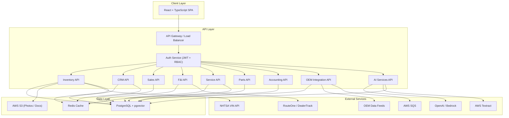

# Dealer Management System (DMS) -- Complete Project Guide

> A comprehensive reference for developers with no prior automotive industry experience.
> Built around: **Node.js, TypeScript, React, PostgreSQL, REST APIs, AWS, Docker, and AI integrations.**

---

## Table of Contents

1. [Domain Overview](#1-domain-overview)
2. [Industry Glossary](#2-industry-glossary)
3. [Core Feature Modules](#3-core-feature-modules)
   - 3.1 Vehicle Inventory Management
   - 3.2 Customer Relationship Management (CRM)
   - 3.3 Sales & Deal Management
   - 3.4 Finance & Insurance (F&I)
   - 3.5 Service & Repair Orders
   - 3.6 Parts Inventory
   - 3.7 Accounting & Reporting
   - 3.8 OEM / Manufacturer Integration
4. [AI-Powered Features](#4-ai-powered-features)
5. [Technical Architecture](#5-technical-architecture)
6. [Sample Data Models & API Endpoints](#6-sample-data-models--api-endpoints)
7. [Database Schema](#7-database-schema)
8. [Getting Started Roadmap](#8-getting-started-roadmap)

---

## 1. Domain Overview

### What Is a Dealer Management System?

A **Dealer Management System (DMS)** is the central software platform that an automotive dealership uses to run every aspect of its business. Think of it as an ERP (Enterprise Resource Planning) system purpose-built for car dealerships. It connects the showroom floor, the service garage, the parts department, the finance office, and the back-office accounting team into a single integrated application.

Dealerships without a DMS rely on disconnected spreadsheets, paper forms, and siloed tools. A DMS eliminates that by providing one source of truth for every vehicle, customer, deal, repair order, and financial transaction.

### Why Dealerships Need a DMS

| Problem Without a DMS | How a DMS Solves It |
|---|---|
| Sales staff can't see which vehicles are available in real time | Centralized vehicle inventory with live status tracking |
| Customer information is scattered across notebooks and inboxes | Unified CRM with full communication history |
| Deal paperwork takes hours and is error-prone | Automated deal worksheets, document generation, and e-signatures |
| Service department double-books appointments | Integrated scheduling with technician capacity planning |
| Parts run out unexpectedly, delaying repairs | Automated reorder points and vendor purchase orders |
| Management has no visibility into profitability | Real-time dashboards, financial reports, and KPI tracking |
| Manufacturer compliance reporting is manual and painful | Automated OEM data feeds and warranty claim submission |

### Key Personas (Users of the System)

| Persona | Role | What They Care About |
|---|---|---|
| **Sales Consultant** | Sells vehicles to customers on the lot | Quick access to inventory, customer history, deal tools |
| **Sales Manager** | Oversees the sales floor, approves deals | Deal profitability, team performance metrics, desking tools |
| **F&I Manager** | Handles financing and insurance products | Credit applications, lender submissions, product menus |
| **Service Advisor** | Customer-facing person in the service department | Appointment scheduling, repair order creation, status updates |
| **Service Technician** | Mechanic who performs the actual work | Work queue, repair instructions, time clock |
| **Parts Manager** | Manages parts inventory and ordering | Stock levels, purchase orders, vendor catalogs |
| **Controller / Accountant** | Handles dealership financials | General ledger, AP/AR, month-end close, tax reports |
| **General Manager / Dealer Principal** | Runs the entire dealership | High-level dashboards, P&L, cross-department KPIs |
| **Customer** | Buys or services a vehicle | Online appointment booking, deal transparency, service history |

---

## 2. Industry Glossary

Understanding automotive terminology is essential before writing any code. Here are the terms you will encounter constantly:

| Term | Definition |
|---|---|
| **VIN** | Vehicle Identification Number -- a unique 17-character code assigned to every vehicle manufactured. Encodes make, model, year, engine, plant, and serial number. Example: `1HGCM82633A004352`. |
| **OEM** | Original Equipment Manufacturer -- the car maker (e.g., Toyota, Ford, BMW). Dealerships are franchised by one or more OEMs. |
| **DMS** | Dealer Management System -- the software you are building. |
| **MSRP** | Manufacturer's Suggested Retail Price -- the "sticker price" set by the OEM. |
| **Invoice Price** | The price the dealership paid the OEM for the vehicle. The difference between MSRP and invoice is the dealer's gross margin on a new car. |
| **F&I** | Finance & Insurance -- the department (and process) where a customer arranges financing and purchases add-on products like extended warranties. |
| **Deal / Deal Jacket** | The complete transaction record for a vehicle sale, including the buyer, trade-in, financing terms, add-on products, and all signed documents. |
| **Desking** | The process of structuring a deal -- negotiating price, trade-in value, monthly payment, and down payment to find numbers that work for both the customer and the dealership. |
| **Trade-In** | A vehicle the customer brings in and sells to the dealership as part of a new purchase. The trade-in value offsets the price of the new vehicle. |
| **ACV** | Actual Cash Value -- the appraised wholesale value of a trade-in vehicle. |
| **Payoff** | The remaining balance on a trade-in vehicle's existing loan. If the payoff exceeds the ACV, the customer has "negative equity." |
| **RO (Repair Order)** | A work ticket in the service department describing the customer complaint, diagnosis, parts used, labor performed, and charges. |
| **CSI** | Customer Satisfaction Index -- a score reported to the OEM based on customer survey results. Dealerships are financially incentivized to maintain high CSI scores. |
| **DMS Integration** | Data exchange between the DMS and external systems (OEM portals, lenders, parts suppliers, CRM vendors, etc.). |
| **Lot / Frontline** | The physical area where vehicles are displayed for sale. "Frontline ready" means a vehicle has been inspected, reconditioned, and is ready to sell. |
| **Recon / Reconditioning** | The process of inspecting, repairing, and cleaning a used vehicle before putting it on the lot for sale. |
| **OBD-II** | On-Board Diagnostics version 2 -- a standardized port in all vehicles (1996+) that technicians plug into to read diagnostic trouble codes (DTCs). |
| **DTC** | Diagnostic Trouble Code -- a standardized code (e.g., P0301 = cylinder 1 misfire) read from the vehicle's computer. |
| **Warranty Claim** | A request submitted to the OEM to reimburse the dealership for repair work covered under the manufacturer's warranty. |
| **Holdback** | A percentage of MSRP or invoice that the OEM pays back to the dealership after a vehicle is sold. This is hidden margin. |
| **Floor Plan** | A line of credit the dealership uses to finance its vehicle inventory. The dealership pays interest on each vehicle until it is sold. |
| **PDI** | Pre-Delivery Inspection -- a checklist performed on new vehicles before delivery to the customer. |
| **BDC** | Business Development Center -- a team (or call center) that handles inbound leads, sets appointments, and follows up with customers. |
| **Up / Be-Back** | An "up" is a walk-in customer. A "be-back" is a customer who visited before and returns. |

---

## 3. Core Feature Modules

### 3.1 Vehicle Inventory Management

**Purpose:** Track every vehicle the dealership owns -- from the moment it arrives (via OEM shipment, auction purchase, or trade-in) to the moment it is sold or wholesaled. This is the heart of the DMS.

#### Key Features

- **Vehicle records** with full specifications (year, make, model, trim, color, mileage, VIN)
- **VIN decoding** -- automatically populate vehicle details by decoding the 17-character VIN using a third-party API (e.g., NHTSA vPIC API, which is free)
- **Stock number assignment** -- each vehicle gets a unique internal stock number
- **Status tracking** -- In Transit, In Recon, Frontline Ready, Sold, Wholesaled
- **Pricing management** -- MSRP, invoice price, internet price, sale price
- **Photo management** -- upload and order multiple photos per vehicle (stored in S3)
- **Vehicle history** -- log every status change, price change, and reconditioning step
- **Lot location tracking** -- which row/spot the vehicle is parked in
- **Aging reports** -- how many days each vehicle has been in inventory (critical because of floor plan interest costs)
- **Search and filtering** -- by make, model, year, price range, color, body style, mileage

#### User Stories

- As a **sales consultant**, I want to search inventory by body style and price so I can quickly find options for a customer.
- As an **inventory manager**, I want to see all vehicles older than 60 days so I can recommend price reductions.
- As a **general manager**, I want a dashboard showing total inventory value, average days in stock, and turn rate.

#### Key Entities

```
Vehicle {
  id, vin, stockNumber, year, make, model, trim,
  exteriorColor, interiorColor, mileage, engineType,
  transmissionType, drivetrain, bodyStyle, fuelType,
  msrp, invoicePrice, internetPrice, salePrice,
  status, condition (New | Used | CPO),
  lotLocation, dateAcquired, dateSold,
  photos[], reconSteps[], priceHistory[]
}
```

---

### 3.2 Customer Relationship Management (CRM)

**Purpose:** Manage every interaction with customers and leads -- from the first website inquiry to post-sale follow-up and service visits years later. The CRM ensures no lead falls through the cracks and gives staff a 360-degree view of each customer.

#### Key Features

- **Customer profiles** -- name, contact info, preferences, purchase history, service history
- **Lead management** -- capture leads from website forms, phone calls, walk-ins, and third-party sources (AutoTrader, Cars.com)
- **Lead assignment** -- automatically or manually assign leads to sales consultants (round-robin, zip code, etc.)
- **Activity tracking** -- log every call, email, text, and in-person visit
- **Task and follow-up management** -- scheduled reminders ("Call John back Tuesday at 2pm")
- **Lead status pipeline** -- New -> Contacted -> Appointment Set -> Showed -> Negotiating -> Sold / Lost
- **Email and SMS templates** -- pre-built messages for common touchpoints
- **Duplicate detection** -- prevent creating duplicate customer records
- **Customer timeline** -- a chronological view of every interaction across sales and service

#### User Stories

- As a **sales consultant**, I want to see today's follow-up tasks so I don't miss any callbacks.
- As a **BDC agent**, I want to log an inbound phone lead and assign it to the right salesperson.
- As a **sales manager**, I want to see lead-to-sale conversion rates by source so I know where to spend marketing dollars.

#### Key Entities

```
Customer {
  id, firstName, lastName, email, phone, address,
  dateOfBirth, driversLicense, preferredContact,
  tags[], notes, createdAt, updatedAt
}

Lead {
  id, customerId, source, status, assignedTo,
  vehicleInterest, tradeInVehicle, notes,
  activities[], tasks[], createdAt, updatedAt
}

Activity {
  id, leadId, customerId, type (call | email | text | visit | note),
  direction (inbound | outbound), content, performedBy, performedAt
}

Task {
  id, leadId, assignedTo, type, description,
  dueAt, completedAt, status
}
```

---

### 3.3 Sales & Deal Management

**Purpose:** Handle the entire vehicle sales process -- from the initial negotiation ("desking") to final paperwork and delivery. This module turns a lead into a closed deal with all the proper financial documentation.

#### Key Features

- **Deal worksheet / desking tool** -- structure the deal by adjusting sale price, trade-in value, down payment, loan term, and interest rate to calculate monthly payments
- **Trade-in appraisal** -- record the trade-in vehicle's details, condition, and appraised value (ACV)
- **Payment calculator** -- compute monthly payments based on amount financed, APR, and term
- **Deal types** -- Cash, Finance, Lease (each has different calculation logic)
- **Deal status pipeline** -- Pending -> F&I -> Contracts Signed -> Delivered -> Funded -> Unwound
- **Document generation** -- auto-generate buyer's order, bill of sale, odometer disclosure, title application using templates
- **E-signature integration** -- send documents for electronic signature
- **Commission tracking** -- calculate salesperson commission based on deal gross profit
- **Deal jacket** -- a digital folder containing every document, note, and record associated with the sale
- **Sales reporting** -- units sold, gross profit, average front-end/back-end gross, by salesperson/month

#### User Stories

- As a **sales consultant**, I want to create a deal worksheet so I can present monthly payment options to my customer.
- As a **sales manager**, I want to approve or counter-offer a deal before it goes to F&I.
- As an **F&I manager**, I want to see the deal structure and customer credit info before the customer walks into my office.

#### Key Entities

```
Deal {
  id, customerId, vehicleId, salesPersonId,
  dealType (Cash | Finance | Lease),
  status, salePrice, tradeInAllowance, tradeInPayoff,
  downPayment, rebates, fees[],
  totalAmountFinanced, apr, term, monthlyPayment,
  frontEndGross, backEndGross, totalGross,
  fiProducts[], documents[], notes,
  createdAt, deliveredAt, fundedAt
}

TradeIn {
  id, dealId, vin, year, make, model, mileage,
  condition, acv, payoffAmount, payoffLender,
  appraisedBy, appraisalNotes
}

DealFee {
  id, dealId, name, amount, isTaxable, isRequired
}
```

#### Deal Math Explained

This is the core financial calculation your desking tool needs to perform:

```
Net Trade        = Trade-In Allowance - Payoff Amount
Amount Financed  = Sale Price + Fees + Taxes - Down Payment - Net Trade - Rebates

Monthly Payment  = AmountFinanced * [r(1+r)^n] / [(1+r)^n - 1]
                   where r = APR/12/100, n = term in months
```

---

### 3.4 Finance & Insurance (F&I)

**Purpose:** After the sales desk structures a deal, the F&I department secures financing through a lender and sells add-on protection products. This is one of the most profitable departments in a dealership.

#### Key Features

- **Credit application** -- collect customer financial information (income, employment, residence) for submission to lenders
- **Lender submission (credit decisioning)** -- submit the credit app to multiple lenders simultaneously via RouteOne or DealerTrack APIs and receive approval/decline decisions
- **F&I product menu** -- present add-on products to the customer:
  - Extended warranty / Vehicle Service Contract (VSC)
  - GAP insurance (covers the "gap" between what insurance pays and what the customer owes if the car is totaled)
  - Tire & wheel protection
  - Paint protection / ceramic coating
  - Theft deterrent
  - Maintenance plans
- **Product pricing and rate markup** -- each product has a cost and a selling price; the difference is F&I gross profit
- **Rate markup** -- lenders offer a "buy rate" (e.g., 5.9%); the dealership can mark it up (e.g., to 7.9%) and keep the spread as profit
- **Contract printing** -- generate and print lender-specific contract forms
- **Compliance** -- ensure all legally required disclosures are presented and signed (varies by state)
- **Chargeback tracking** -- if a customer cancels an F&I product or defaults on the loan early, the dealership may owe money back; track these chargebacks

#### User Stories

- As an **F&I manager**, I want to submit a credit application to 5 lenders at once and see their responses in a comparison table.
- As an **F&I manager**, I want to present a product menu on a tablet showing the payment with and without each product.
- As a **controller**, I want to see total F&I revenue per deal and track chargebacks.

#### Key Entities

```
CreditApplication {
  id, dealId, customerId,
  annualIncome, employer, employmentLength,
  housingType, monthlyHousingPayment,
  ssn (encrypted), dateOfBirth,
  lenderSubmissions[], status, createdAt
}

LenderDecision {
  id, creditApplicationId, lenderId,
  decision (Approved | Conditional | Declined),
  approvedAmount, buyRate, maxTerm, stipulations[],
  receivedAt
}

FIProduct {
  id, dealId, productType, provider,
  cost, sellingPrice, term, deductible,
  contractNumber, status
}
```

---

### 3.5 Service & Repair Orders

**Purpose:** Manage the dealership's service department -- from booking a customer appointment to completing the repair, billing the customer, and submitting warranty claims. Service is a major revenue driver and the primary way dealerships maintain long-term customer relationships.

#### Key Features

- **Appointment scheduling** -- online and phone-based booking with time-slot management
- **Service advisor workflow** -- greet the customer, document complaints, create a repair order (RO)
- **Repair order (RO) management** -- the central document for all service work:
  - Customer complaint lines (what the customer reports)
  - Diagnosis / cause (what the tech finds)
  - Correction / repair (what was done to fix it)
  - Parts used
  - Labor time (flagged hours vs. clock hours)
  - Pay type per line: Customer Pay, Warranty, Internal, Sublet
- **Technician dispatch** -- assign RO lines to specific technicians based on skill and availability
- **Multi-point inspection** -- a standardized vehicle inspection checklist (tires, brakes, fluids, belts, etc.) with green/yellow/red ratings
- **Service status board** -- a real-time view of all vehicles in the shop and their progress
- **Customer communication** -- text/email updates: "Your vehicle is ready for pickup"
- **Warranty claim submission** -- submit eligible repairs to the OEM for reimbursement
- **Service history** -- full history of all work performed on a vehicle, searchable by VIN or customer
- **Canned jobs / op-codes** -- predefined service packages (e.g., "Oil Change" = specific labor time + specific parts)

#### User Stories

- As a **customer**, I want to book a service appointment online and pick a convenient time slot.
- As a **service advisor**, I want to create an RO with multiple concern lines and assign them to technicians.
- As a **technician**, I want to see my work queue, clock in/out of jobs, and flag parts I need.
- As a **service manager**, I want to see effective labor rate, hours per RO, and technician productivity.

#### Key Entities

```
Appointment {
  id, customerId, vehicleId, advisorId,
  scheduledAt, duration, concerns[],
  status (Scheduled | Checked-In | No-Show | Completed),
  createdAt
}

RepairOrder {
  id, appointmentId, customerId, vehicleId,
  advisorId, roNumber, status,
  lines[], parts[], inspections[],
  subtotalParts, subtotalLabor, tax, total,
  openedAt, closedAt
}

ROLine {
  id, repairOrderId, technicianId,
  complaint, cause, correction,
  laborHours, laborRate, payType,
  opCode, status
}

ServicePart {
  id, roLineId, partId, partNumber,
  description, quantity, unitCost, unitPrice
}
```

---

### 3.6 Parts Inventory

**Purpose:** Track every part in the dealership's parts department -- from OEM parts on the shelf to aftermarket accessories. Ensure the right parts are available when technicians need them and manage purchasing from vendors.

#### Key Features

- **Parts catalog** -- searchable database of parts with part numbers, descriptions, pricing, and bin locations
- **Stock management** -- quantity on hand, quantity on order, reorder point, reorder quantity
- **Purchase orders** -- create POs to OEM parts distributors and aftermarket vendors
- **Parts receiving** -- log received shipments and update inventory counts
- **Parts usage** -- when a tech uses a part on an RO, it decrements inventory automatically
- **Special-order parts** -- order a specific part for a specific RO and track its arrival
- **Lost sales tracking** -- record when a customer asks for a part you don't have (helps inform stocking decisions)
- **Bin location management** -- physical warehouse location for each part (aisle, shelf, bin)
- **Inventory reports** -- total value on hand, slow-moving parts, stockout frequency, fill rate
- **Returns processing** -- handle defective or incorrect parts returns to vendors

#### User Stories

- As a **parts advisor**, I want to look up a part by number or description and see if it's in stock.
- As a **technician**, I want to request a part for my RO and have it pulled from the bin.
- As a **parts manager**, I want automatic PO suggestions when stock falls below reorder points.

#### Key Entities

```
Part {
  id, partNumber, oemPartNumber, description,
  category, manufacturer, unitCost, unitPrice,
  quantityOnHand, quantityOnOrder,
  reorderPoint, reorderQuantity,
  binLocation, isActive, lastSoldAt
}

PurchaseOrder {
  id, vendorId, status, lines[],
  subtotal, tax, total,
  orderedAt, expectedAt, receivedAt
}

PurchaseOrderLine {
  id, purchaseOrderId, partId,
  quantityOrdered, quantityReceived,
  unitCost
}

Vendor {
  id, name, accountNumber, contactName,
  email, phone, address, leadTimeDays
}
```

---

### 3.7 Accounting & Reporting

**Purpose:** Manage all dealership financials -- the general ledger, accounts payable, accounts receivable, and management reporting. Dealerships use a standardized chart of accounts that maps to OEM financial statement requirements.

#### Key Features

- **General Ledger (GL)** -- chart of accounts following the NADA standard account structure, which organizes accounts by department (New, Used, Service, Parts, Body Shop, Admin)
- **Journal entries** -- every deal, RO, and parts sale automatically creates GL entries
- **Accounts Payable (AP)** -- track vendor bills, schedule payments, print checks or submit ACH
- **Accounts Receivable (AR)** -- track money owed to the dealership (warranty receivables, customer balances, lender funding)
- **Deal posting** -- when a deal is finalized, it generates the proper accounting entries (revenue, cost of goods sold, finance reserve, F&I income, trade-in book value)
- **Bank reconciliation** -- match bank statement transactions to GL entries
- **Floor plan reconciliation** -- reconcile the floor plan credit line with actual vehicle inventory
- **Financial statements** -- Balance Sheet, Income Statement (P&L), Schedule of Accounts
- **Management dashboards** -- KPIs like total gross profit, units sold, service absorption rate, parts gross margin, F&I per vehicle retailed (PVR)
- **Payroll integration** -- calculate and track salesperson commissions, technician flag pay

#### User Stories

- As a **controller**, I want deals to automatically post to the GL so I don't re-enter data.
- As a **general manager**, I want a dashboard showing this month's gross profit vs. last month and vs. budget.
- As an **accountant**, I want to reconcile the floor plan and identify any vehicles that are "out of trust" (sold but not yet paid off on the credit line).

#### Key Entities

```
GLAccount {
  id, accountNumber, name, type (Asset | Liability | Equity | Revenue | Expense),
  department, parentAccountId, isActive
}

JournalEntry {
  id, date, description, reference,
  sourceType (Deal | RepairOrder | PurchaseOrder | Manual),
  sourceId, lines[], postedBy, postedAt
}

JournalEntryLine {
  id, journalEntryId, accountId,
  debit, credit, description
}

PayableInvoice {
  id, vendorId, invoiceNumber, amount,
  dueDate, status, paidAt, checkNumber
}

ReceivableInvoice {
  id, customerId, type, amount,
  dueDate, status, paidAt
}
```

---

### 3.8 OEM / Manufacturer Integration

**Purpose:** Dealerships are franchised by OEMs and must exchange data with them regularly. This module handles the automated data feeds and compliance reporting that every dealership is required to perform.

#### Key Features

- **Vehicle order and allocation** -- receive vehicle allocation data from the OEM (what vehicles are being shipped to the dealership)
- **Vehicle inventory reporting** -- send current inventory status to the OEM on a regular schedule
- **Warranty claim submission** -- submit completed warranty repairs for reimbursement, including labor times, parts used, and cause/correction codes
- **Warranty claim status tracking** -- receive approval/rejection status from the OEM
- **Incentive and rebate programs** -- receive current rebate/incentive program data from the OEM and apply them to deals
- **Parts ordering** -- electronic parts ordering directly from the OEM parts distribution network
- **CSI / survey management** -- receive customer satisfaction survey results and track scores
- **Compliance reporting** -- submit required reports (sales data, inventory data) in OEM-specific formats
- **Recall management** -- receive recall notices and identify affected vehicles in inventory and customer database

#### User Stories

- As a **service advisor**, I want the system to alert me if a vehicle has an open recall when I create an RO.
- As a **warranty clerk**, I want to submit warranty claims electronically and track their payment status.
- As a **sales manager**, I want to see current manufacturer incentives so I can apply them to deals.

#### Key Entities

```
WarrantyClaim {
  id, repairOrderId, vehicleId, oemClaimNumber,
  laborCode, laborHours, laborAmount,
  parts[], totalAmount, status,
  submittedAt, paidAt, rejectionReason
}

OEMProgram {
  id, oemId, programName, type (Rebate | Rate | Bonus),
  amount, eligibilityCriteria, startDate, endDate,
  stackable, requiresFinancing
}

Recall {
  id, oemRecallNumber, description, affectedVins[],
  remedy, partsRequired[], laborTime,
  safetyRelated, status
}
```

---

## 4. AI-Powered Features

These features leverage LLMs, machine learning, and AI services to add intelligence to the DMS. They align with the job description's emphasis on designing and integrating AI-enabled capabilities.

### 4.1 Intelligent Vehicle Search & Recommendations

**What it does:** Customers and sales staff can describe what they want in natural language ("I need a reliable family SUV under $35,000 with good gas mileage") and the system returns matching vehicles ranked by relevance.

**How to build it:**
- Use OpenAI's embeddings API or AWS Bedrock to create vector embeddings of vehicle descriptions
- Store embeddings in PostgreSQL using the `pgvector` extension
- On search, embed the user's query and perform a cosine similarity search
- Combine semantic similarity with structured filters (price, mileage, year) for hybrid search

```typescript
// Example: Vehicle search endpoint
POST /api/vehicles/smart-search
Body: {
  "query": "family SUV under 35000 with good mileage",
  "filters": { "maxPrice": 35000, "bodyStyle": "SUV" }
}
Response: Vehicle[] ranked by relevance score
```

### 4.2 AI-Powered Lead Scoring

**What it does:** Automatically score incoming leads based on likelihood to convert, so BDC agents and salespeople focus on the hottest leads first.

**How to build it:**
- Collect historical lead data: source, response time, engagement signals, vehicle viewed, trade-in mentioned, credit pre-qualification
- Train a simple classification model or use an LLM with structured prompting
- Score each lead 0-100 and surface the score in the CRM list view

### 4.3 Automated Vehicle Description Generation

**What it does:** When a vehicle is added to inventory, automatically generate a compelling marketing description for the website listing using the vehicle's specifications.

**How to build it:**
- Call OpenAI / AWS Bedrock with a prompt containing the vehicle's structured data
- Include dealership-specific tone and compliance rules in the system prompt
- Allow the user to review, edit, and approve the generated text before publishing

```typescript
// Example prompt construction
const prompt = `Write a compelling 150-word vehicle listing description for:
  ${vehicle.year} ${vehicle.make} ${vehicle.model} ${vehicle.trim}
  Color: ${vehicle.exteriorColor}
  Mileage: ${vehicle.mileage.toLocaleString()} miles
  Key features: ${vehicle.features.join(', ')}
  Tone: Professional, enthusiastic, trustworthy.
  Do not make claims about reliability or safety ratings.`;
```

### 4.4 OCR Document Processing

**What it does:** Scan and extract data from physical documents that customers bring in -- driver's licenses, insurance cards, vehicle titles, and trade-in registration. Auto-populate form fields instead of manual data entry.

**How to build it:**
- Use AWS Textract or a similar OCR service
- Upload the document image to S3, trigger Textract analysis
- Map extracted key-value pairs to the appropriate customer or vehicle fields
- Present results for human review before saving

### 4.5 Service Demand Forecasting

**What it does:** Predict service appointment volume by day/hour so the service department can staff appropriately and avoid overbooking.

**How to build it:**
- Analyze historical appointment data by day of week, time of day, season, and weather
- Use a time series model or a simple LLM-based analysis
- Display predicted demand on the scheduling calendar as suggested capacity limits

### 4.6 Sales & Service Copilot (Chatbot)

**What it does:** An internal chatbot that dealership staff can ask questions like "What's the warranty coverage on a 2023 Accord?" or "How do I submit a recall repair?" The copilot has access to dealership SOPs, OEM documentation, and vehicle data.

**How to build it:**
- Implement a RAG (Retrieval Augmented Generation) pipeline:
  1. Ingest dealership SOPs, OEM manuals, and DMS documentation
  2. Chunk and embed documents, store in pgvector
  3. On query, retrieve relevant chunks and feed them to the LLM as context
- Expose via a chat UI component in the DMS

### 4.7 Pricing Optimization

**What it does:** Suggest optimal pricing for used vehicles based on market data, vehicle condition, local demand, and days in inventory.

**How to build it:**
- Ingest market data from sources like Kelley Blue Book API, Manheim auction data, or local listings
- Factor in the vehicle's condition, mileage, age, and how long it has been in stock
- Use an LLM or ML model to suggest a competitive price range
- Alert the inventory manager when a vehicle is overpriced relative to market

---

## 5. Technical Architecture

### Technology Stack

| Layer | Technology | Purpose |
|---|---|---|
| **Frontend** | React + TypeScript | Single-page application with module-based routing |
| **UI Library** | Material UI or Ant Design | Pre-built components for forms, tables, dashboards |
| **State Management** | React Query + Zustand | Server state caching + client-side state |
| **Backend** | Node.js + TypeScript (NestJS) | RESTful API with modular architecture |
| **ORM** | Prisma or TypeORM | Type-safe database access |
| **Database** | PostgreSQL | Primary relational data store |
| **Vector Store** | pgvector (PostgreSQL extension) | AI embedding storage for semantic search |
| **Object Storage** | AWS S3 | Vehicle photos, documents, scanned IDs |
| **AI / LLM** | OpenAI API / AWS Bedrock | Text generation, embeddings, analysis |
| **OCR** | AWS Textract | Document scanning and data extraction |
| **Message Queue** | AWS SQS | Async processing (OEM feeds, report generation) |
| **Cache** | Redis | Session management, frequently accessed data |
| **Auth** | JWT + Role-Based Access Control | Secure API access with per-module permissions |
| **Testing** | Jest + Supertest + Cypress | Unit, integration, and end-to-end testing |
| **CI/CD** | GitHub Actions | Automated build, test, and deploy |
| **Containers** | Docker + Kubernetes (EKS) | Consistent environments, scalable deployment |
| **CDN** | AWS CloudFront | Serve frontend assets and vehicle photos |
| **Monitoring** | AWS CloudWatch + Sentry | Logging, error tracking, performance monitoring |

### High-Level Architecture Diagram



### Backend Project Structure

```
src/
├── main.ts                          # Application entry point
├── app.module.ts                    # Root NestJS module
├── common/                          # Shared utilities
│   ├── decorators/                  # Custom decorators (@Roles, @CurrentUser)
│   ├── guards/                      # Auth guards (JwtAuthGuard, RolesGuard)
│   ├── interceptors/                # Logging, transform interceptors
│   ├── filters/                     # Exception filters
│   ├── pipes/                       # Validation pipes
│   └── utils/                       # Helper functions (VIN decoder, payment calc)
├── modules/
│   ├── auth/                        # Authentication & authorization
│   │   ├── auth.module.ts
│   │   ├── auth.controller.ts
│   │   ├── auth.service.ts
│   │   ├── strategies/              # JWT strategy, local strategy
│   │   └── dto/                     # LoginDto, RegisterDto
│   ├── inventory/                   # Vehicle inventory management
│   │   ├── inventory.module.ts
│   │   ├── inventory.controller.ts
│   │   ├── inventory.service.ts
│   │   ├── entities/                # Vehicle entity
│   │   └── dto/                     # CreateVehicleDto, UpdateVehicleDto
│   ├── crm/                         # Customer & lead management
│   ├── sales/                       # Deal management & desking
│   ├── fi/                          # Finance & insurance
│   ├── service/                     # Repair orders & appointments
│   ├── parts/                       # Parts inventory
│   ├── accounting/                  # GL, AP, AR
│   ├── oem/                         # OEM integrations
│   └── ai/                          # AI service wrappers
│       ├── ai.module.ts
│       ├── ai.controller.ts
│       ├── ai.service.ts
│       ├── embeddings.service.ts    # Vector embedding management
│       ├── ocr.service.ts           # Document scanning
│       └── generation.service.ts    # Text generation (descriptions, etc.)
├── database/
│   ├── migrations/                  # Database migration files
│   └── seeds/                       # Seed data for development
└── config/                          # Environment-specific configuration
```

### Frontend Project Structure

```
src/
├── index.tsx                        # Entry point
├── App.tsx                          # Root component with router
├── api/                             # API client (axios instance, hooks)
│   ├── client.ts                    # Configured axios instance
│   ├── inventory.api.ts             # Inventory endpoints
│   ├── crm.api.ts                   # CRM endpoints
│   └── ...
├── components/                      # Shared UI components
│   ├── Layout/                      # Shell, sidebar, header
│   ├── DataTable/                   # Reusable table with sort/filter/paginate
│   ├── FormFields/                  # Input components
│   └── Dashboard/                   # Chart and KPI card components
├── modules/                         # Feature modules (route-based code splitting)
│   ├── inventory/
│   │   ├── pages/                   # VehicleListPage, VehicleDetailPage
│   │   ├── components/              # VehicleCard, VINDecoder, PhotoUploader
│   │   └── hooks/                   # useVehicles, useVehicleSearch
│   ├── crm/
│   ├── sales/
│   ├── fi/
│   ├── service/
│   ├── parts/
│   ├── accounting/
│   └── ai/                          # AI feature components
│       ├── SmartSearch.tsx
│       ├── DescriptionGenerator.tsx
│       ├── DocumentScanner.tsx
│       └── Copilot.tsx
├── hooks/                           # Global custom hooks
├── store/                           # Zustand stores
├── types/                           # Shared TypeScript interfaces
└── utils/                           # Formatting, validation helpers
```

---

## 6. Sample Data Models & API Endpoints

### TypeScript Interfaces (Shared Between Frontend and Backend)

```typescript
// types/vehicle.ts
export interface Vehicle {
  id: string;
  vin: string;
  stockNumber: string;
  year: number;
  make: string;
  model: string;
  trim: string;
  bodyStyle: 'Sedan' | 'SUV' | 'Truck' | 'Coupe' | 'Convertible' | 'Van' | 'Wagon' | 'Hatchback';
  exteriorColor: string;
  interiorColor: string;
  mileage: number;
  engineType: string;
  transmission: 'Automatic' | 'Manual' | 'CVT';
  drivetrain: 'FWD' | 'RWD' | 'AWD' | '4WD';
  fuelType: 'Gasoline' | 'Diesel' | 'Hybrid' | 'Electric';
  condition: 'New' | 'Used' | 'CPO';
  status: 'InTransit' | 'InRecon' | 'FrontlineReady' | 'Sold' | 'Wholesaled';
  msrp: number;
  invoicePrice: number | null;
  internetPrice: number;
  salePrice: number | null;
  lotLocation: string | null;
  photos: VehiclePhoto[];
  features: string[];
  description: string | null;
  dateAcquired: string;
  dateSold: string | null;
  daysInStock: number;
  createdAt: string;
  updatedAt: string;
}

export interface VehiclePhoto {
  id: string;
  url: string;
  sortOrder: number;
  isPrimary: boolean;
}

// types/customer.ts
export interface Customer {
  id: string;
  firstName: string;
  lastName: string;
  email: string | null;
  phone: string;
  address: Address | null;
  dateOfBirth: string | null;
  driversLicenseNumber: string | null;
  driversLicenseState: string | null;
  preferredContactMethod: 'phone' | 'email' | 'text';
  tags: string[];
  totalPurchases: number;
  lastVisitDate: string | null;
  createdAt: string;
  updatedAt: string;
}

export interface Address {
  street: string;
  city: string;
  state: string;
  zip: string;
}

// types/deal.ts
export interface Deal {
  id: string;
  dealNumber: string;
  customerId: string;
  vehicleId: string;
  salesPersonId: string;
  salesManagerId: string | null;
  fiManagerId: string | null;
  dealType: 'Cash' | 'Finance' | 'Lease';
  status: 'Pending' | 'Desking' | 'FI' | 'ContractsSigned' | 'Delivered' | 'Funded' | 'Unwound';
  salePrice: number;
  tradeIn: TradeIn | null;
  downPayment: number;
  rebates: number;
  fees: DealFee[];
  taxRate: number;
  taxAmount: number;
  totalAmountFinanced: number;
  apr: number | null;
  term: number | null;
  monthlyPayment: number | null;
  lenderId: string | null;
  frontEndGross: number;
  backEndGross: number;
  totalGross: number;
  fiProducts: FIProduct[];
  createdAt: string;
  deliveredAt: string | null;
  fundedAt: string | null;
}

export interface TradeIn {
  id: string;
  vin: string;
  year: number;
  make: string;
  model: string;
  mileage: number;
  condition: 'Excellent' | 'Good' | 'Fair' | 'Poor';
  acv: number;
  allowance: number;
  payoffAmount: number;
  payoffLender: string | null;
}

export interface DealFee {
  id: string;
  name: string;
  amount: number;
  isTaxable: boolean;
}

export interface FIProduct {
  id: string;
  productType: string;
  provider: string;
  cost: number;
  sellingPrice: number;
  term: number | null;
}

// types/repair-order.ts
export interface RepairOrder {
  id: string;
  roNumber: string;
  customerId: string;
  vehicleId: string;
  advisorId: string;
  status: 'Open' | 'InProgress' | 'WaitingParts' | 'WaitingApproval' | 'Complete' | 'Invoiced' | 'Closed';
  lines: ROLine[];
  subtotalParts: number;
  subtotalLabor: number;
  tax: number;
  total: number;
  openedAt: string;
  closedAt: string | null;
}

export interface ROLine {
  id: string;
  lineNumber: number;
  technicianId: string | null;
  complaint: string;
  cause: string | null;
  correction: string | null;
  opCode: string | null;
  laborHours: number;
  laborRate: number;
  payType: 'CustomerPay' | 'Warranty' | 'Internal' | 'Sublet';
  parts: ServicePart[];
  status: 'Pending' | 'InProgress' | 'Complete';
}

export interface ServicePart {
  id: string;
  partNumber: string;
  description: string;
  quantity: number;
  unitCost: number;
  unitPrice: number;
}
```

### REST API Endpoints

#### Inventory Module

| Method | Endpoint | Description |
|---|---|---|
| GET | `/api/vehicles` | List vehicles with filtering, sorting, pagination |
| GET | `/api/vehicles/:id` | Get single vehicle details |
| POST | `/api/vehicles` | Add a new vehicle |
| PATCH | `/api/vehicles/:id` | Update vehicle details |
| DELETE | `/api/vehicles/:id` | Remove a vehicle (soft delete) |
| POST | `/api/vehicles/:id/photos` | Upload photos (multipart) |
| DELETE | `/api/vehicles/:id/photos/:photoId` | Delete a photo |
| GET | `/api/vehicles/vin-decode/:vin` | Decode a VIN and return vehicle specs |
| POST | `/api/vehicles/smart-search` | AI-powered natural language search |
| POST | `/api/vehicles/:id/generate-description` | Generate AI listing description |
| GET | `/api/vehicles/reports/aging` | Aging inventory report |

#### CRM Module

| Method | Endpoint | Description |
|---|---|---|
| GET | `/api/customers` | List customers with search/filter |
| GET | `/api/customers/:id` | Get customer with full history |
| POST | `/api/customers` | Create a customer |
| PATCH | `/api/customers/:id` | Update customer info |
| GET | `/api/leads` | List leads with filters (status, assignee, source) |
| POST | `/api/leads` | Create a new lead |
| PATCH | `/api/leads/:id` | Update lead (status, assignment) |
| POST | `/api/leads/:id/activities` | Log an activity (call, email, visit) |
| GET | `/api/leads/:id/activities` | Get lead activity history |
| POST | `/api/leads/:id/tasks` | Create a follow-up task |
| GET | `/api/tasks/my` | Get current user's tasks for today |

#### Sales Module

| Method | Endpoint | Description |
|---|---|---|
| GET | `/api/deals` | List deals with filters |
| GET | `/api/deals/:id` | Get deal with full details |
| POST | `/api/deals` | Create a new deal |
| PATCH | `/api/deals/:id` | Update deal (price, terms, status) |
| POST | `/api/deals/:id/desk` | Calculate payment scenarios |
| POST | `/api/deals/:id/trade-in` | Add/update trade-in appraisal |
| POST | `/api/deals/:id/fees` | Add a fee to the deal |
| POST | `/api/deals/:id/documents` | Generate deal documents |
| POST | `/api/deals/:id/deliver` | Mark deal as delivered |
| GET | `/api/deals/reports/summary` | Sales summary report |

#### Service Module

| Method | Endpoint | Description |
|---|---|---|
| GET | `/api/appointments` | List appointments with date range |
| POST | `/api/appointments` | Book a new appointment |
| PATCH | `/api/appointments/:id` | Update appointment (reschedule, cancel) |
| GET | `/api/repair-orders` | List repair orders |
| GET | `/api/repair-orders/:id` | Get RO with full details |
| POST | `/api/repair-orders` | Create a new RO |
| POST | `/api/repair-orders/:id/lines` | Add a line to the RO |
| PATCH | `/api/repair-orders/:id/lines/:lineId` | Update an RO line (assign tech, add parts) |
| POST | `/api/repair-orders/:id/close` | Close and invoice the RO |
| GET | `/api/service/history/:vin` | Get full service history by VIN |
| GET | `/api/service/board` | Service status board (real-time view) |

#### Parts Module

| Method | Endpoint | Description |
|---|---|---|
| GET | `/api/parts` | Search parts catalog |
| GET | `/api/parts/:id` | Get part details with stock info |
| POST | `/api/parts` | Add a new part to catalog |
| PATCH | `/api/parts/:id` | Update part info or stock |
| POST | `/api/purchase-orders` | Create a purchase order |
| PATCH | `/api/purchase-orders/:id/receive` | Receive a shipment |
| GET | `/api/parts/reports/low-stock` | Parts below reorder point |

#### AI Module

| Method | Endpoint | Description |
|---|---|---|
| POST | `/api/ai/vehicle-search` | Natural language vehicle search |
| POST | `/api/ai/generate-description` | Generate vehicle listing copy |
| POST | `/api/ai/scan-document` | OCR a document and extract fields |
| POST | `/api/ai/lead-score` | Score a lead |
| POST | `/api/ai/copilot` | Chat with the DMS copilot |
| POST | `/api/ai/price-suggestion` | Get pricing recommendation |

---

## 7. Database Schema

Below are the core SQL table definitions. These use PostgreSQL syntax.

```sql
-- Enable pgvector extension for AI features
CREATE EXTENSION IF NOT EXISTS vector;

-- ============================================================
-- VEHICLES
-- ============================================================
CREATE TABLE vehicles (
    id              UUID PRIMARY KEY DEFAULT gen_random_uuid(),
    vin             VARCHAR(17) UNIQUE NOT NULL,
    stock_number    VARCHAR(20) UNIQUE NOT NULL,
    year            SMALLINT NOT NULL,
    make            VARCHAR(50) NOT NULL,
    model           VARCHAR(50) NOT NULL,
    trim            VARCHAR(100),
    body_style      VARCHAR(30),
    exterior_color  VARCHAR(50),
    interior_color  VARCHAR(50),
    mileage         INTEGER NOT NULL DEFAULT 0,
    engine_type     VARCHAR(50),
    transmission    VARCHAR(20),
    drivetrain      VARCHAR(10),
    fuel_type       VARCHAR(20),
    condition       VARCHAR(10) NOT NULL CHECK (condition IN ('New', 'Used', 'CPO')),
    status          VARCHAR(20) NOT NULL DEFAULT 'InRecon'
                    CHECK (status IN ('InTransit','InRecon','FrontlineReady','Sold','Wholesaled')),
    msrp            NUMERIC(12,2),
    invoice_price   NUMERIC(12,2),
    internet_price  NUMERIC(12,2),
    sale_price      NUMERIC(12,2),
    lot_location    VARCHAR(50),
    description     TEXT,
    features        JSONB DEFAULT '[]',
    embedding       vector(1536),  -- for AI semantic search
    date_acquired   DATE NOT NULL DEFAULT CURRENT_DATE,
    date_sold       DATE,
    created_at      TIMESTAMPTZ NOT NULL DEFAULT NOW(),
    updated_at      TIMESTAMPTZ NOT NULL DEFAULT NOW()
);

CREATE INDEX idx_vehicles_status ON vehicles(status);
CREATE INDEX idx_vehicles_make_model ON vehicles(make, model);
CREATE INDEX idx_vehicles_year ON vehicles(year);
CREATE INDEX idx_vehicles_embedding ON vehicles USING ivfflat (embedding vector_cosine_ops) WITH (lists = 100);

-- ============================================================
-- VEHICLE PHOTOS
-- ============================================================
CREATE TABLE vehicle_photos (
    id          UUID PRIMARY KEY DEFAULT gen_random_uuid(),
    vehicle_id  UUID NOT NULL REFERENCES vehicles(id) ON DELETE CASCADE,
    url         TEXT NOT NULL,
    sort_order  SMALLINT NOT NULL DEFAULT 0,
    is_primary  BOOLEAN NOT NULL DEFAULT FALSE,
    created_at  TIMESTAMPTZ NOT NULL DEFAULT NOW()
);

-- ============================================================
-- CUSTOMERS
-- ============================================================
CREATE TABLE customers (
    id                      UUID PRIMARY KEY DEFAULT gen_random_uuid(),
    first_name              VARCHAR(100) NOT NULL,
    last_name               VARCHAR(100) NOT NULL,
    email                   VARCHAR(255),
    phone                   VARCHAR(20),
    street                  VARCHAR(255),
    city                    VARCHAR(100),
    state                   VARCHAR(2),
    zip                     VARCHAR(10),
    date_of_birth           DATE,
    drivers_license_number  VARCHAR(50),
    drivers_license_state   VARCHAR(2),
    preferred_contact       VARCHAR(10) DEFAULT 'phone',
    tags                    JSONB DEFAULT '[]',
    created_at              TIMESTAMPTZ NOT NULL DEFAULT NOW(),
    updated_at              TIMESTAMPTZ NOT NULL DEFAULT NOW()
);

CREATE INDEX idx_customers_name ON customers(last_name, first_name);
CREATE INDEX idx_customers_email ON customers(email);
CREATE INDEX idx_customers_phone ON customers(phone);

-- ============================================================
-- LEADS
-- ============================================================
CREATE TABLE leads (
    id                UUID PRIMARY KEY DEFAULT gen_random_uuid(),
    customer_id       UUID NOT NULL REFERENCES customers(id),
    source            VARCHAR(50) NOT NULL,  -- 'Website', 'Phone', 'WalkIn', 'AutoTrader', etc.
    status            VARCHAR(30) NOT NULL DEFAULT 'New'
                      CHECK (status IN ('New','Contacted','AppointmentSet','Showed','Negotiating','Sold','Lost')),
    assigned_to       UUID REFERENCES users(id),
    vehicle_of_interest UUID REFERENCES vehicles(id),
    ai_score          SMALLINT,  -- 0-100 AI lead score
    notes             TEXT,
    created_at        TIMESTAMPTZ NOT NULL DEFAULT NOW(),
    updated_at        TIMESTAMPTZ NOT NULL DEFAULT NOW()
);

-- ============================================================
-- ACTIVITIES (CRM timeline events)
-- ============================================================
CREATE TABLE activities (
    id            UUID PRIMARY KEY DEFAULT gen_random_uuid(),
    lead_id       UUID REFERENCES leads(id),
    customer_id   UUID NOT NULL REFERENCES customers(id),
    type          VARCHAR(20) NOT NULL CHECK (type IN ('call','email','text','visit','note')),
    direction     VARCHAR(10) CHECK (direction IN ('inbound','outbound')),
    content       TEXT,
    performed_by  UUID NOT NULL REFERENCES users(id),
    performed_at  TIMESTAMPTZ NOT NULL DEFAULT NOW()
);

-- ============================================================
-- TASKS (follow-ups)
-- ============================================================
CREATE TABLE tasks (
    id            UUID PRIMARY KEY DEFAULT gen_random_uuid(),
    lead_id       UUID REFERENCES leads(id),
    assigned_to   UUID NOT NULL REFERENCES users(id),
    type          VARCHAR(30) NOT NULL,
    description   TEXT,
    due_at        TIMESTAMPTZ NOT NULL,
    completed_at  TIMESTAMPTZ,
    status        VARCHAR(20) NOT NULL DEFAULT 'Pending'
                  CHECK (status IN ('Pending','Completed','Cancelled')),
    created_at    TIMESTAMPTZ NOT NULL DEFAULT NOW()
);

-- ============================================================
-- DEALS
-- ============================================================
CREATE TABLE deals (
    id                    UUID PRIMARY KEY DEFAULT gen_random_uuid(),
    deal_number           VARCHAR(20) UNIQUE NOT NULL,
    customer_id           UUID NOT NULL REFERENCES customers(id),
    vehicle_id            UUID NOT NULL REFERENCES vehicles(id),
    sales_person_id       UUID NOT NULL REFERENCES users(id),
    sales_manager_id      UUID REFERENCES users(id),
    fi_manager_id         UUID REFERENCES users(id),
    deal_type             VARCHAR(10) NOT NULL CHECK (deal_type IN ('Cash','Finance','Lease')),
    status                VARCHAR(20) NOT NULL DEFAULT 'Pending'
                          CHECK (status IN ('Pending','Desking','FI','ContractsSigned','Delivered','Funded','Unwound')),
    sale_price            NUMERIC(12,2) NOT NULL,
    down_payment          NUMERIC(12,2) NOT NULL DEFAULT 0,
    rebates               NUMERIC(12,2) NOT NULL DEFAULT 0,
    tax_rate              NUMERIC(5,4),
    tax_amount            NUMERIC(12,2),
    total_amount_financed NUMERIC(12,2),
    apr                   NUMERIC(5,3),
    term                  SMALLINT,
    monthly_payment       NUMERIC(10,2),
    lender_id             UUID,
    front_end_gross       NUMERIC(12,2),
    back_end_gross        NUMERIC(12,2),
    total_gross           NUMERIC(12,2),
    created_at            TIMESTAMPTZ NOT NULL DEFAULT NOW(),
    delivered_at          TIMESTAMPTZ,
    funded_at             TIMESTAMPTZ
);

-- ============================================================
-- TRADE-INS
-- ============================================================
CREATE TABLE trade_ins (
    id              UUID PRIMARY KEY DEFAULT gen_random_uuid(),
    deal_id         UUID NOT NULL REFERENCES deals(id) ON DELETE CASCADE,
    vin             VARCHAR(17),
    year            SMALLINT,
    make            VARCHAR(50),
    model           VARCHAR(50),
    mileage         INTEGER,
    condition       VARCHAR(20),
    acv             NUMERIC(12,2) NOT NULL,
    allowance       NUMERIC(12,2) NOT NULL,
    payoff_amount   NUMERIC(12,2) NOT NULL DEFAULT 0,
    payoff_lender   VARCHAR(100),
    appraised_by    UUID REFERENCES users(id),
    notes           TEXT,
    created_at      TIMESTAMPTZ NOT NULL DEFAULT NOW()
);

-- ============================================================
-- DEAL FEES
-- ============================================================
CREATE TABLE deal_fees (
    id          UUID PRIMARY KEY DEFAULT gen_random_uuid(),
    deal_id     UUID NOT NULL REFERENCES deals(id) ON DELETE CASCADE,
    name        VARCHAR(100) NOT NULL,
    amount      NUMERIC(10,2) NOT NULL,
    is_taxable  BOOLEAN NOT NULL DEFAULT FALSE,
    is_required BOOLEAN NOT NULL DEFAULT FALSE
);

-- ============================================================
-- F&I PRODUCTS
-- ============================================================
CREATE TABLE fi_products (
    id              UUID PRIMARY KEY DEFAULT gen_random_uuid(),
    deal_id         UUID NOT NULL REFERENCES deals(id) ON DELETE CASCADE,
    product_type    VARCHAR(50) NOT NULL,
    provider        VARCHAR(100),
    cost            NUMERIC(10,2) NOT NULL,
    selling_price   NUMERIC(10,2) NOT NULL,
    term_months     SMALLINT,
    deductible      NUMERIC(10,2),
    contract_number VARCHAR(50),
    status          VARCHAR(20) NOT NULL DEFAULT 'Active'
);

-- ============================================================
-- APPOINTMENTS
-- ============================================================
CREATE TABLE appointments (
    id              UUID PRIMARY KEY DEFAULT gen_random_uuid(),
    customer_id     UUID NOT NULL REFERENCES customers(id),
    vehicle_id      UUID REFERENCES vehicles(id),
    advisor_id      UUID REFERENCES users(id),
    scheduled_at    TIMESTAMPTZ NOT NULL,
    duration_minutes SMALLINT NOT NULL DEFAULT 60,
    concerns        JSONB DEFAULT '[]',
    status          VARCHAR(20) NOT NULL DEFAULT 'Scheduled'
                    CHECK (status IN ('Scheduled','CheckedIn','InProgress','Complete','NoShow','Cancelled')),
    created_at      TIMESTAMPTZ NOT NULL DEFAULT NOW()
);

-- ============================================================
-- REPAIR ORDERS
-- ============================================================
CREATE TABLE repair_orders (
    id              UUID PRIMARY KEY DEFAULT gen_random_uuid(),
    ro_number       VARCHAR(20) UNIQUE NOT NULL,
    appointment_id  UUID REFERENCES appointments(id),
    customer_id     UUID NOT NULL REFERENCES customers(id),
    vehicle_id      UUID NOT NULL REFERENCES vehicles(id),
    advisor_id      UUID NOT NULL REFERENCES users(id),
    status          VARCHAR(20) NOT NULL DEFAULT 'Open'
                    CHECK (status IN ('Open','InProgress','WaitingParts','WaitingApproval','Complete','Invoiced','Closed')),
    subtotal_parts  NUMERIC(10,2) NOT NULL DEFAULT 0,
    subtotal_labor  NUMERIC(10,2) NOT NULL DEFAULT 0,
    tax             NUMERIC(10,2) NOT NULL DEFAULT 0,
    total           NUMERIC(10,2) NOT NULL DEFAULT 0,
    opened_at       TIMESTAMPTZ NOT NULL DEFAULT NOW(),
    closed_at       TIMESTAMPTZ
);

-- ============================================================
-- REPAIR ORDER LINES
-- ============================================================
CREATE TABLE ro_lines (
    id              UUID PRIMARY KEY DEFAULT gen_random_uuid(),
    repair_order_id UUID NOT NULL REFERENCES repair_orders(id) ON DELETE CASCADE,
    line_number     SMALLINT NOT NULL,
    technician_id   UUID REFERENCES users(id),
    complaint       TEXT NOT NULL,
    cause           TEXT,
    correction      TEXT,
    op_code         VARCHAR(20),
    labor_hours     NUMERIC(5,2) NOT NULL DEFAULT 0,
    labor_rate      NUMERIC(8,2) NOT NULL,
    pay_type        VARCHAR(20) NOT NULL CHECK (pay_type IN ('CustomerPay','Warranty','Internal','Sublet')),
    status          VARCHAR(20) NOT NULL DEFAULT 'Pending'
                    CHECK (status IN ('Pending','InProgress','Complete')),
    created_at      TIMESTAMPTZ NOT NULL DEFAULT NOW()
);

-- ============================================================
-- SERVICE PARTS (parts used on an RO line)
-- ============================================================
CREATE TABLE service_parts (
    id          UUID PRIMARY KEY DEFAULT gen_random_uuid(),
    ro_line_id  UUID NOT NULL REFERENCES ro_lines(id) ON DELETE CASCADE,
    part_id     UUID NOT NULL REFERENCES parts(id),
    part_number VARCHAR(50) NOT NULL,
    description VARCHAR(200),
    quantity    SMALLINT NOT NULL DEFAULT 1,
    unit_cost   NUMERIC(10,2) NOT NULL,
    unit_price  NUMERIC(10,2) NOT NULL
);

-- ============================================================
-- PARTS CATALOG
-- ============================================================
CREATE TABLE parts (
    id                UUID PRIMARY KEY DEFAULT gen_random_uuid(),
    part_number       VARCHAR(50) UNIQUE NOT NULL,
    oem_part_number   VARCHAR(50),
    description       VARCHAR(255) NOT NULL,
    category          VARCHAR(50),
    manufacturer      VARCHAR(100),
    unit_cost         NUMERIC(10,2) NOT NULL,
    unit_price        NUMERIC(10,2) NOT NULL,
    quantity_on_hand  INTEGER NOT NULL DEFAULT 0,
    quantity_on_order INTEGER NOT NULL DEFAULT 0,
    reorder_point     INTEGER NOT NULL DEFAULT 5,
    reorder_quantity  INTEGER NOT NULL DEFAULT 10,
    bin_location      VARCHAR(30),
    is_active         BOOLEAN NOT NULL DEFAULT TRUE,
    last_sold_at      TIMESTAMPTZ,
    created_at        TIMESTAMPTZ NOT NULL DEFAULT NOW(),
    updated_at        TIMESTAMPTZ NOT NULL DEFAULT NOW()
);

-- ============================================================
-- VENDORS
-- ============================================================
CREATE TABLE vendors (
    id              UUID PRIMARY KEY DEFAULT gen_random_uuid(),
    name            VARCHAR(200) NOT NULL,
    account_number  VARCHAR(50),
    contact_name    VARCHAR(100),
    email           VARCHAR(255),
    phone           VARCHAR(20),
    address         TEXT,
    lead_time_days  SMALLINT DEFAULT 3,
    is_active       BOOLEAN NOT NULL DEFAULT TRUE,
    created_at      TIMESTAMPTZ NOT NULL DEFAULT NOW()
);

-- ============================================================
-- PURCHASE ORDERS
-- ============================================================
CREATE TABLE purchase_orders (
    id          UUID PRIMARY KEY DEFAULT gen_random_uuid(),
    vendor_id   UUID NOT NULL REFERENCES vendors(id),
    status      VARCHAR(20) NOT NULL DEFAULT 'Draft'
                CHECK (status IN ('Draft','Submitted','PartiallyReceived','Received','Cancelled')),
    subtotal    NUMERIC(12,2),
    tax         NUMERIC(10,2),
    total       NUMERIC(12,2),
    ordered_at  TIMESTAMPTZ,
    expected_at DATE,
    received_at TIMESTAMPTZ,
    created_at  TIMESTAMPTZ NOT NULL DEFAULT NOW()
);

CREATE TABLE purchase_order_lines (
    id                  UUID PRIMARY KEY DEFAULT gen_random_uuid(),
    purchase_order_id   UUID NOT NULL REFERENCES purchase_orders(id) ON DELETE CASCADE,
    part_id             UUID NOT NULL REFERENCES parts(id),
    quantity_ordered    INTEGER NOT NULL,
    quantity_received   INTEGER NOT NULL DEFAULT 0,
    unit_cost           NUMERIC(10,2) NOT NULL
);

-- ============================================================
-- GENERAL LEDGER
-- ============================================================
CREATE TABLE gl_accounts (
    id                UUID PRIMARY KEY DEFAULT gen_random_uuid(),
    account_number    VARCHAR(20) UNIQUE NOT NULL,
    name              VARCHAR(200) NOT NULL,
    type              VARCHAR(20) NOT NULL CHECK (type IN ('Asset','Liability','Equity','Revenue','Expense')),
    department        VARCHAR(30),  -- 'New', 'Used', 'Service', 'Parts', 'BodyShop', 'Admin'
    parent_account_id UUID REFERENCES gl_accounts(id),
    is_active         BOOLEAN NOT NULL DEFAULT TRUE
);

CREATE TABLE journal_entries (
    id          UUID PRIMARY KEY DEFAULT gen_random_uuid(),
    entry_date  DATE NOT NULL,
    description VARCHAR(500),
    reference   VARCHAR(100),
    source_type VARCHAR(30),  -- 'Deal', 'RepairOrder', 'PurchaseOrder', 'Manual'
    source_id   UUID,
    posted_by   UUID NOT NULL REFERENCES users(id),
    posted_at   TIMESTAMPTZ NOT NULL DEFAULT NOW()
);

CREATE TABLE journal_entry_lines (
    id                UUID PRIMARY KEY DEFAULT gen_random_uuid(),
    journal_entry_id  UUID NOT NULL REFERENCES journal_entries(id) ON DELETE CASCADE,
    account_id        UUID NOT NULL REFERENCES gl_accounts(id),
    debit             NUMERIC(14,2) NOT NULL DEFAULT 0,
    credit            NUMERIC(14,2) NOT NULL DEFAULT 0,
    description       VARCHAR(255)
);

-- ============================================================
-- USERS (dealership staff)
-- ============================================================
CREATE TABLE users (
    id              UUID PRIMARY KEY DEFAULT gen_random_uuid(),
    email           VARCHAR(255) UNIQUE NOT NULL,
    password_hash   VARCHAR(255) NOT NULL,
    first_name      VARCHAR(100) NOT NULL,
    last_name       VARCHAR(100) NOT NULL,
    role            VARCHAR(30) NOT NULL,
    department      VARCHAR(30),
    is_active       BOOLEAN NOT NULL DEFAULT TRUE,
    created_at      TIMESTAMPTZ NOT NULL DEFAULT NOW(),
    updated_at      TIMESTAMPTZ NOT NULL DEFAULT NOW()
);

-- ============================================================
-- WARRANTY CLAIMS
-- ============================================================
CREATE TABLE warranty_claims (
    id                UUID PRIMARY KEY DEFAULT gen_random_uuid(),
    repair_order_id   UUID NOT NULL REFERENCES repair_orders(id),
    vehicle_id        UUID NOT NULL REFERENCES vehicles(id),
    oem_claim_number  VARCHAR(50),
    labor_code        VARCHAR(20),
    labor_hours       NUMERIC(5,2),
    labor_amount      NUMERIC(10,2),
    parts_amount      NUMERIC(10,2),
    total_amount      NUMERIC(10,2),
    status            VARCHAR(20) NOT NULL DEFAULT 'Draft'
                      CHECK (status IN ('Draft','Submitted','Approved','Rejected','Paid')),
    submitted_at      TIMESTAMPTZ,
    paid_at           TIMESTAMPTZ,
    rejection_reason  TEXT
);

-- ============================================================
-- RECALLS
-- ============================================================
CREATE TABLE recalls (
    id                  UUID PRIMARY KEY DEFAULT gen_random_uuid(),
    oem_recall_number   VARCHAR(50) UNIQUE NOT NULL,
    description         TEXT NOT NULL,
    remedy              TEXT,
    affected_vins       JSONB DEFAULT '[]',
    parts_required      JSONB DEFAULT '[]',
    labor_time          NUMERIC(5,2),
    safety_related      BOOLEAN NOT NULL DEFAULT FALSE,
    created_at          TIMESTAMPTZ NOT NULL DEFAULT NOW()
);
```

---

## 8. Getting Started Roadmap

### Phase 1: Foundation (Weeks 1-3)

Set up the project infrastructure and build the first module.

1. **Project scaffolding** -- Initialize the NestJS backend and React frontend with TypeScript. Set up ESLint, Prettier, and Git hooks.
2. **Docker setup** -- Create `docker-compose.yml` with PostgreSQL, Redis, and the app containers.
3. **Database migrations** -- Set up Prisma (or TypeORM) and create the initial migration for the `users` and `vehicles` tables.
4. **Authentication** -- Implement JWT-based auth with role-based access control. Define roles: Admin, SalesConsultant, SalesManager, FIManager, ServiceAdvisor, Technician, PartsAdvisor, Controller.
5. **Vehicle Inventory Module** -- Build CRUD for vehicles, VIN decoding integration (NHTSA API), photo upload to S3, and a search/filter list page.

**Why start here:** Vehicles are the central entity. Nearly every other module references them. Getting this right first creates a solid foundation.

### Phase 2: CRM & Sales (Weeks 4-6)

6. **Customer Management** -- CRUD for customers with duplicate detection and search.
7. **Lead Management** -- Lead creation, assignment, status pipeline, activity logging, and task follow-ups.
8. **Deal Management** -- Deal creation, desking calculator (payment math), trade-in appraisal, fee management, and status pipeline.
9. **Document Generation** -- Use a template engine (e.g., Handlebars or PDFKit) to generate buyer's orders and bills of sale.

**Why next:** This is the core sales workflow. Leads become customers, customers buy vehicles through deals.

### Phase 3: Service & Parts (Weeks 7-9)

10. **Appointment Scheduling** -- Calendar view, time-slot management, online booking form.
11. **Repair Orders** -- RO creation, line management, technician assignment, parts usage.
12. **Parts Inventory** -- Parts catalog, stock management, purchase orders, receiving.
13. **Service History** -- Searchable history by VIN or customer.

**Why next:** Service is the second-largest revenue source and directly uses parts inventory.

### Phase 4: F&I & Accounting (Weeks 10-12)

14. **F&I Module** -- Credit application forms, product menu, rate markup calculations.
15. **Accounting Basics** -- Chart of accounts, automated journal entries from deals and ROs, basic financial reports.
16. **Dashboards** -- Management dashboards with KPIs (gross profit, units sold, service absorption, F&I PVR).

**Why last among core modules:** F&I depends on deals; accounting depends on everything.

### Phase 5: AI Features (Weeks 13-15)

17. **Semantic Vehicle Search** -- Embed vehicle descriptions with OpenAI, store in pgvector, build the search endpoint and UI.
18. **Description Generator** -- LLM-powered vehicle listing generation.
19. **Document OCR** -- Scan driver's licenses and insurance cards with AWS Textract.
20. **Lead Scoring** -- Score leads using historical patterns.
21. **Copilot Chat** -- RAG-based internal chatbot.

**Why last:** AI features enhance existing functionality. Build the core system first, then layer intelligence on top.

### Phase 6: OEM Integration & Polish (Weeks 16-18)

22. **OEM Data Feeds** -- Warranty claim submission, recall checking, incentive program sync.
23. **Testing** -- Comprehensive unit tests (Jest), API integration tests (Supertest), and E2E tests (Cypress).
24. **CI/CD Pipeline** -- GitHub Actions for automated build, test, lint, and deploy to AWS.
25. **Performance Optimization** -- Database query optimization, Redis caching, pagination, lazy loading.

### Useful External References

| Resource | URL | What It Provides |
|---|---|---|
| NHTSA VIN Decoder API | https://vpic.nhtsa.dot.gov/api/ | Free VIN decoding (vehicle specs from VIN) |
| NHTSA Recalls API | https://www.nhtsa.gov/recalls | Recall lookup by VIN |
| OBD-II Code Reference | https://www.obd-codes.com/ | Diagnostic trouble code definitions |
| NADA Dealership Financial Profile | https://www.nada.org/ | Industry financial benchmarks and standard chart of accounts |
| RouteOne | https://www.routeone.com/ | Credit application and lender integration platform |
| DealerTrack | https://www.dealertrack.com/ | Alternative credit/lender integration platform |

---

> **Tip for newcomers:** Start by shadowing a real dealership if possible. Spend a day watching how a sales consultant works an "up," how the F&I manager presents products, and how the service advisor writes an RO. The domain knowledge you gain will make your code dramatically better.
